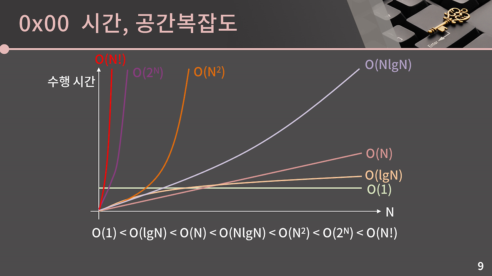
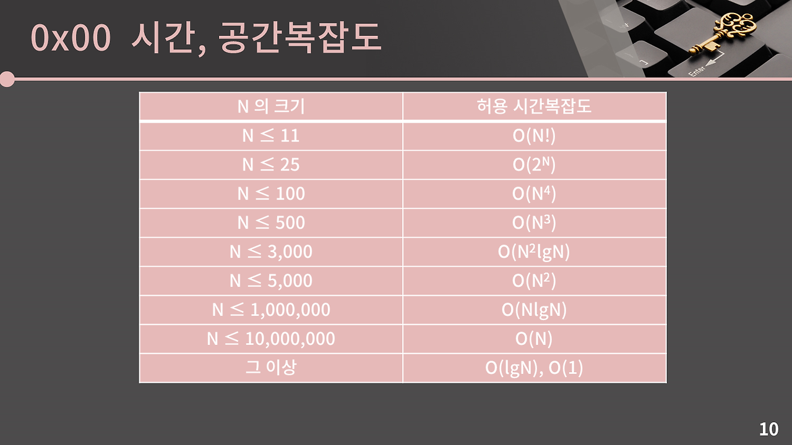

## 시간, 공간복잡도  
### 시간복잡도
python은 1초에 1억 번의 연산을 수행할 수 있음  
문제에서 주어진 시간제한이 1초라면 1억번의 연산을 할 수 있는 코드를 구현하면 됨  

시간복잡도는 조금 rough하게 접근해도 된다.  
-> `5n + 3`이라면 적당히 `n`번의 연산이 필요하다  

예시)  
1. 만약 N명의 사람 중 '가나다'를 찾고 있는데, 한 명씩 이름을 물어보고 대답하는 데 1초가 걸린다면  
    - 최선의 경우 1초  
    - 최악의 경우 N초  
    - 평균은 N/2초  
2. 만약 N명의 사람이 '순서대로' 서있는데, '가나다'를 찾고 있고 한 명씩 이름을 물어보고 대답하는 데 1초가 걸린다면  
    - 최선의 경우 1초
    - 최악의 경우 lgN초  
    - 평균은 lgN초  
    중간 사람에게 이름을 물어보며 찾는 범위를 줄일 수 있기 때문이다.  

  

표를 통해 대략적인 느낌 가져가기  
다시 말하지만 시간복잡도는 rough하게만 연산해도 충분하다!  

문제를 보고 풀이를 떠올린 다음 무턱대고 짜는 것이 아니라 **내 풀이가 이 문제를 시간 내로 통과할 수 있는지 = 내 알고리즘의 시간복잡도가 올바른지 생각하기**  

```python
# 1번 문제: O(N)
def func1(N):
    res = 0
    for n in range(1, N):
        if n % 3 == 0:
            res += n
        elif n % 5 == 0:
            res += n
    return res

N = int(input())
print(func1(N))
```

```python
# 2번 문제: O(N^2)
def func2(arr, N):
    for n1 in range(N):
        for n2 in range(N):
            if n1 == n2:
                continue
            if arr[n1] + arr[n2] == 100:
                return 1
    return 0

N = int(input())
arr = list(map(int, input().split()))[:N]
print(func2(arr, N))
```  

```python
# 3번 문제: O(root(N))
def func3(N):
    i = 1
    num = 1
    while num <= N :
        num = i * i
        if num == N:
            return 1
        i += 1
    return 0

N = int(input())
print(func3(N))
```
### 공간복잡도  
: 입력의 크기와 문제를 해결하는 데 필요한 공간의 상관관계
N짜리 2차원 배열이 필요하면 O(N^2), 따로 배열이 필요하지 않으면 O(1)  
**메모리 제한이 512MB일 때, int 변수를 대략 1.2억개 정도 선언할 수 있음 - int 1개가 4바이트라는 것을 이용해 계산**  


## 정수 자료형  
## 실수 자료형  
